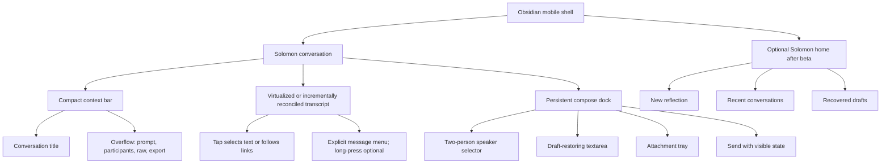

# Solomon Chat Mobile UX Audit

Audit date: 2026-08-10  
Repository: `WestB-DEV/Solomon-Chat`  
Audited commit: `64119b1827e6518635b2ec31f68078a69a80668f`  
Scope: read-only code and UX review for iPhone and Android. No application code, commits, releases, or remote state were changed.

## Executive decision

Solomon Chat has a stronger mobile foundation than its current desktop-first impression suggests: the manifest allows mobile, the plugin avoids desktop-only Node/Electron APIs, the composer uses `VisualViewport`, writes are serialized, Markdown remains the durable source of truth, and a keyboard-geometry simulator already exists.

It is **not yet mobile-release-proven**. The simulator demonstrates four hand-authored viewport cases, but it does not exercise the Obsidian Capacitor shells, app suspension, destructive message actions, accessibility services, large conversations, attachment pickers, or physical keyboards. Three issues should be treated as release-blocking P0 work:

1. An unsent draft exists only in memory and can be lost when iOS/Android suspends or kills Obsidian.
2. Sending is a two-write operation: `next-side` is changed before the message is appended. If the second write fails, a retry can be attributed to the wrong participant.
3. Keyboard clearance is capped at half the chat height after calculation. In short landscape viewports, the cap can deliberately leave the composer underneath the keyboard.

The recommended product direction is a **one-handed conversation surface**, not a squeezed desktop toolbar: compact context at the top, messages in the middle, an unambiguous two-person speaker selector and composer at the bottom, and secondary actions in one overflow sheet.

## What is already good

- `manifest.json:9` declares `isDesktopOnly: false`.
- `src/plugin.ts` uses Obsidian `Platform`, `Vault`, `FileManager`, `TFile`, and `normalizePath`; the audited source has no `fs`, `path`, `electron`, `process.platform`, `fetch`, or Axios dependency.
- `src/viewport.ts:18-28` isolates keyboard geometry as a pure function with iPhone, Android-offset, resized-layout, and desktop regression cases.
- `src/plugin.ts:36` serializes writes by file, reducing rapid-send overwrite risk.
- `src/plugin.ts:120` supplies `enterkeyhint="send"` and sentence autocapitalization.
- `src/plugin.ts:132-134` respects IME composition before interpreting Enter.
- `src/plugin.ts:174-175` deliberately avoids auto-opening the software keyboard on mobile.
- `styles.css:132-135` honors reduced-motion preferences.
- The chat remains ordinary Markdown with ordinary attachment links, which gives recovery and interoperability a strong base.

## Findings

Severity meaning:

- **P0**: blocks a reliability-first mobile beta or risks losing/misattributing user work.
- **P1**: materially harms the primary mobile workflow, accessibility, or long-session reliability.
- **P2**: important polish, discovery, or scale improvement after the beta gate.

### P0-01 — Drafts do not survive mobile lifecycle events

Evidence:

- `ViewState.draft` is an in-memory string (`src/plugin.ts:21`).
- It is updated only by the textarea input handler (`src/plugin.ts:126`) and reset on file changes (`src/plugin.ts:151`).
- There is no persistence on `visibilitychange`, app pause/resume, plugin unload, or debounced input.

Impact: iOS and Android routinely suspend or evict apps. A long reflective entry can disappear before Send, which violates the product's core trust promise.

Recommendation: create a versioned draft store keyed by vault identity plus file path. Debounce saves (for example, 300–500 ms), flush on `visibilitychange`/unload, restore on state creation, and delete only after a confirmed append. Store drafts in plugin data, not the conversation note. Add a visible “Draft restored” notice only when recovery actually occurs.

Acceptance evidence:

- Type 1,000+ characters, background/kill/relaunch Obsidian, and recover the exact draft on both platforms.
- Switching notes and renaming a conversation does not leak a draft into another conversation.
- Successful send clears the durable draft only after the note contains the message.

### P0-02 — A partial send can advance the speaker without appending the message

Evidence:

- `submit()` first changes frontmatter with `processFrontMatter` (`src/plugin.ts:243-245`).
- It then separately appends the message with `vault.process` (`src/plugin.ts:245`).
- The error path preserves the draft but does not repair a successfully advanced `next-side` (`src/plugin.ts:250`).

Impact: if the second operation fails because of sync contention, storage pressure, or lifecycle interruption, the user's retry can be sent as the opposite participant. This is silent authorship corruption, more serious than a visual glitch.

Recommendation: introduce stable message IDs and an idempotent send transaction. The persisted operation must either (a) append a uniquely identified message and advance the next speaker in one transformation, or (b) use a recoverable pending-operation journal with reconciliation/rollback. Do not rely on two unrelated successful writes. Add failure injection between every persistence step.

Acceptance evidence:

- Forced failure before, between, and after persistence steps yields exactly zero or one message, never the wrong speaker, and a recoverable draft.
- Rapid double-tap, duplicate OS event, and app suspension cannot duplicate the message.

### P0-03 — The keyboard clearance cap can force overlap in landscape

Evidence:

- `calculateViewportLayout()` correctly computes the visual viewport clearance (`src/viewport.ts:20-27`).
- `applyViewport()` then clamps it to `rect.height * 0.5` (`src/plugin.ts:391`).
- Existing tests assert only the pure calculation; they never exercise this later cap (`tests/viewport.test.ts`).

Impact: on a short landscape viewport, keyboards commonly consume more than half the remaining chat height. The cap guarantees that some of the keyboard height is ignored, so the composer can be covered.

Recommendation: remove the arbitrary 50% cap. Clamp only to a validated, non-negative geometric maximum based on the root and visible viewport. Put the final applied-clearance calculation in the pure tested module so production and the harness cannot diverge.

Acceptance evidence:

- Portrait and landscape tests cover keyboard heights above and below 50%, `visualViewport.offsetTop`, toolbar shown/hidden, hardware keyboard, floating keyboard, and open-close-open cycles.
- The composer has at least 8 px visible separation from keyboard/native toolbar in every supported case.

### P1-01 — Primary touch targets are below both platform recommendations

Evidence:

- Header/attachment icons are 32×32 px (`styles.css:52-55`).
- Send is 34×34 px (`styles.css:97`).
- Participant avatars are 28×28 px and the participant button has only 0.2 rem padding (`styles.css:41-49`).

Apple recommends at least 44×44 pt hit regions; Android recommends at least 48×48 dp. Small adjacent actions are especially error-prone in the header and composer.

Recommendation: make mobile hit regions at least 48×48 CSS px while retaining 20–24 px icons. Use spacing, not only invisible overlap, so adjacent targets do not collide. Preserve desktop density through a mobile class/media rule.

### P1-02 — Mobile information architecture exposes a desktop action bar

Evidence:

- The header renders two participant controls plus up to four action icons (`src/plugin.ts:179-190`).
- Under 700 px it becomes two stacked rows (`styles.css:116-121`), consuming scarce vertical space.
- When the composer has focus the entire header disappears (`styles.css:127-128`), including prompts and participant context.

Impact: actions have unclear hierarchy, the screen changes substantially on focus, and secondary functions compete with the conversation. The tiny sender pill is the only always-present speaker switch.

Recommendation: retain a compact single-row context bar (conversation title + overflow). Move prompts, participant editing, raw Markdown, and export into an Obsidian `Menu`/mobile sheet. Make speaker choice a clearly labeled two-option segmented control directly above or inside the composer, with color plus text/position rather than color alone.

### P1-03 — Delete is immediate, index-based, and has no undo

Evidence:

- Long-press opens a menu and Delete calls `deleteMessage()` directly (`src/plugin.ts:224-234`).
- The operation removes `messageIndex` from the current file (`src/plugin.ts:305-315`).
- There is no confirmation, undo notice, tombstone, or stable message identifier.

Impact: long-press menus on touch screens are imprecise; external edits between opening the menu and choosing an action can also shift indexes. A destructive tap can remove the wrong or intended message with no in-app recovery.

Recommendation: give each new message a stable ID while remaining human-readable and backward compatible. Resolve edits by ID/fingerprint, provide an Undo notice after delete, and require confirmation only when undo cannot be guaranteed. Expose the same action through an accessible overflow button; do not make long-press the only route.

### P1-04 — Full transcript rerenders do not scale on mobile

Evidence:

- Vault modify and metadata changed events both schedule a refresh (`src/plugin.ts:57-58`).
- Every refresh reads and reparses the entire note (`src/plugin.ts:101-109`).
- `render()` unloads the rendering component, empties the message list, and Markdown-renders every message again (`src/plugin.ts:153-165`).

Impact: work grows roughly with conversation length on every send/edit/sync event. Image-heavy or long conversations will cause jank, scroll jumps, battery use, and memory pressure on mobile.

Recommendation: separate shell creation from transcript reconciliation. Diff by stable message ID; append the newly confirmed message without clearing old DOM; rerender only changed items; debounce/coalesce duplicate vault/cache events; preserve scroll anchor when the user is reading history. Establish a performance budget and test 100, 500, and 2,000 text messages plus image cases.

### P1-05 — The live region can reannounce the entire conversation

Evidence:

- The message container is `role="log" aria-live="polite"` (`src/plugin.ts:117`).
- That live region is emptied and rebuilt on each refresh (`src/plugin.ts:157-165`).
- Every bubble is a tab stop (`src/plugin.ts:222`), creating hundreds of focus stops in long chats.

Impact: VoiceOver/TalkBack may announce excessive content and keyboard/switch users must traverse every bubble.

Recommendation: make the transcript a semantic list/log without making every noninteractive bubble focusable. Use one visually hidden polite announcer for “Message sent as X” and additions received from external sync. Give only links and explicit message-action buttons focus. Test rotor/headings/controls and TalkBack traversal order.

### P1-06 — Attachment picking has cancel, memory, and orphan-file risks

Evidence:

- A hidden `<input type="file" multiple>` is appended to `document.body` (`src/plugin.ts:328-330`).
- The promise resolves only on `change`; picker cancel has no explicit resolution/cleanup path.
- Each selected file is fully materialized with `file.arrayBuffer()` before `createBinary` (`src/plugin.ts:336-342`).
- Files are written before the user sends the message, so abandoning the draft leaves unattached files.

Impact: repeated cancels can leave hidden inputs/promises; large camera media can spike memory; abandoned drafts accumulate orphaned attachments. HEIC display is claimed by extension but not proven on both shells.

Recommendation: handle the input `cancel` event plus window focus fallback; always remove the input in a finally path; warn/cap large files before reading; show attachment chips with remove/retry states; either defer import until send or track and clean up draft-owned files safely. Physically test photo library, camera capture where available, Files/Documents, HEIC, large images, permission denial, cancel, and low-storage failure.

### P1-07 — Modal forms are not designed for the mobile keyboard

Evidence:

- Every `FormModal` autofocuses its first field (`src/modals.ts:48`), immediately opening the software keyboard.
- Participant editing presents six fields in one standard settings form (`src/plugin.ts:288-302`).
- There is no mobile-specific sheet layout, sticky action area, safe-area rule, or unsaved-change guard.

Recommendation: do not autofocus on `Platform.isMobile`; use a full-height/sheet layout with one participant section at a time, 16 px minimum input text, sticky Save/Cancel above the safe area, and a dirty-state dismissal check. Keep creation to the minimum fields and defer bios/avatars to later editing.

### P1-08 — The automated harness is geometry-only and can drift from production

Evidence:

- The harness contains copied static markup rather than mounting the plugin UI (`tests/mobile-harness.html:73-96`).
- It toggles classes and pure geometry but does not exercise sending, attachments, menus, modals, lifecycle, Obsidian APIs, or accessibility (`tests/mobile-harness.ts`).
- `TESTING.md:54-64` explicitly says physical iPhone and Android testing remains required.
- The README screenshot labeled “Phone keyboard layout test” is the simulator, not evidence from Obsidian mobile.

Recommendation: keep the fast pure geometry suite, but add component-level DOM tests from production factories and a physical-device release checklist with recorded device/OS/Obsidian/plugin versions and screen recordings. Do not label the mobile beta accepted until this matrix passes.

### P2-01 — Conversation discovery depends on generic Obsidian navigation

The create ribbon/command is useful, but there is no mobile-first Solomon landing surface for recent conversations, unfinished drafts, search, or “new reflection.” Add this only after the reliability beta: a lightweight home view or modal sourced from frontmatter, with recent conversations and recovered drafts. Avoid scanning the entire vault on every launch; maintain or query an efficient cache.

### P2-02 — The header's participant buttons do not match their apparent purpose

Tapping either participant opens the same participant-edit modal (`src/plugin.ts:195-207`), while switching is performed by the small composer pill. On a phone, users are likely to expect tapping a person to select that speaker. Make speaker selection explicit and move profile editing behind overflow.

### P2-03 — Mobile text, contrast, and content extremes need explicit coverage

The metadata text is 11 px (`styles.css:71`) and sender text is 12 px (`styles.css:95`); custom user colors can create low contrast. Add contrast validation/warnings, system text scaling checks, long participant names, right-to-left content, CJK/emoji/combining text, long URLs, code blocks, tables, and very tall images to the matrix.

## Recommended mobile information architecture



### Text wireframe: conversation, keyboard closed

```text
┌──────────────────────────────────────┐
│ A hard decision                 •••  │  compact context bar
├──────────────────────────────────────┤
│                         Me · 9:12     │
│             ┌──────────────────────┐ │
│             │ I keep going in...  │ │
│             └──────────────────────┘ │
│ Solomon · 9:13                       │
│ ┌──────────────────────────────┐     │
│ │ What would you tell a friend?│  ⋯  │
│ └──────────────────────────────┘     │
│                                      │
├──────────────────────────────────────┤
│  [ Solomon ] [ Me ✓ ]                │  unambiguous speaker
│  ＋  Write as Me…              ↑     │  48px targets
└──────────────────────────────────────┘
```

When the keyboard opens, collapse only the context bar's nonessential detail. Keep the speaker selector, draft, attachment state, and Send visible. The dock must sit above both the visual viewport keyboard boundary and Obsidian's native toolbar/safe area.

## Device and test matrix

| Dimension | Minimum physical coverage | Required scenarios |
|---|---|---|
| iPhone compact | iPhone SE-class or smallest supported viewport | portrait/landscape, large text, VoiceOver, keyboard repeat cycle |
| iPhone modern | iPhone 15/16-class device with notch/home indicator | safe areas, predictive bar, dictation, photo picker, background/kill/restore |
| iPhone large | Pro Max-class viewport | long lines, reachability, rotation, external keyboard if available |
| Android reference | Recent Pixel with Gboard | visual viewport offset, gesture nav/3-button nav, split screen, TalkBack |
| Android OEM | Recent Samsung with Samsung Keyboard and/or Gboard | OEM WebView/keyboard behavior, back gesture, photo/document picker |
| Android constrained | Older/lower-memory supported device | 500/2,000 messages, large image, low storage, app eviction |
| Themes | Default light/dark plus one popular custom theme | contrast, CSS variable compatibility, high contrast modes |
| Input | Default keyboards, dictation, emoji, composition IME, hardware keyboard | Enter/Shift+Enter, composing text, multiline, rapid send |
| Lifecycle | foreground/background, lock/unlock, process kill, plugin disable/re-enable | exact draft recovery, no duplicates, correct speaker |
| Sync/concurrency | edit same note from another device during open draft/send | stable IDs, merge behavior, no wrong-index edit/delete |
| Attachments | cancel, denial, camera/library/files, HEIC/JPEG/PNG/PDF, large file | cleanup, preview, low-memory and low-storage failures |
| Accessibility | VoiceOver, TalkBack, keyboard/switch traversal | labels, focus order, live announcements, non-gesture alternatives |

## Sources and evidence limits

- Official Obsidian plugin self-critique checklist: <https://docs.obsidian.md/oo/plugin>. It confirms mobile plugins should avoid top-level Node/Electron modules, use `Platform`, use Vault/FileManager APIs, minimize load work, and support Deferred Views expectations.
- Official Obsidian load-time guide: <https://docs.obsidian.md/plugins/guides/load-time>. It recommends production builds, light `onload()` work, and deferring startup UI work until layout is ready.
- Apple UI design guidance: <https://developer.apple.com/design/tips/>. It recommends touch controls of at least 44×44 points.
- Android accessibility guidance: <https://developer.android.com/guide/topics/ui/accessibility/views/apps-views>. It recommends focusable touch targets of at least 48×48 dp and purpose descriptions.
- MDN VisualViewport reference: <https://developer.mozilla.org/en-US/docs/Web/API/VisualViewport>. It explains that software keyboards can shrink the visual viewport without changing the layout viewport, supporting the repo's basic approach.

Uncertainties:

- No physical iPhone or Android session was available in this audit.
- No Obsidian runtime/devtools trace was captured.
- `npm`/Node was not available on the audit host PATH, so the existing test/build claims could not be independently rerun in this task. The repository's last recorded harness geometry is evidence from its documentation, not fresh verification.
- Capacitor, WebView, Obsidian version, third-party theme, and keyboard behavior vary; conclusions about actual overlap and menu/picker behavior require the physical matrix.
- The audit reviewed commit `64119b1`; later repository changes are outside scope.
