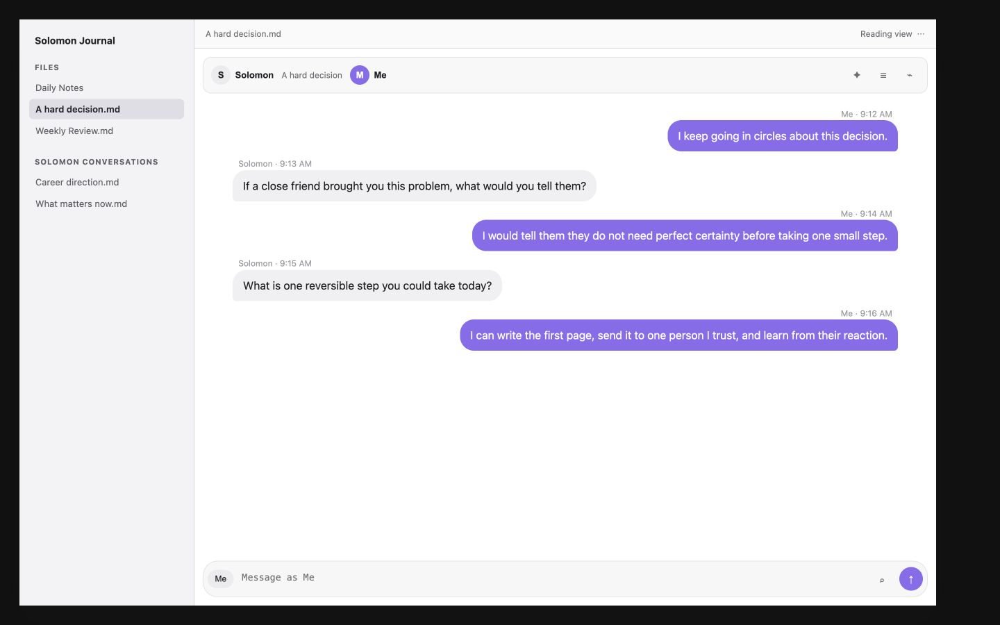
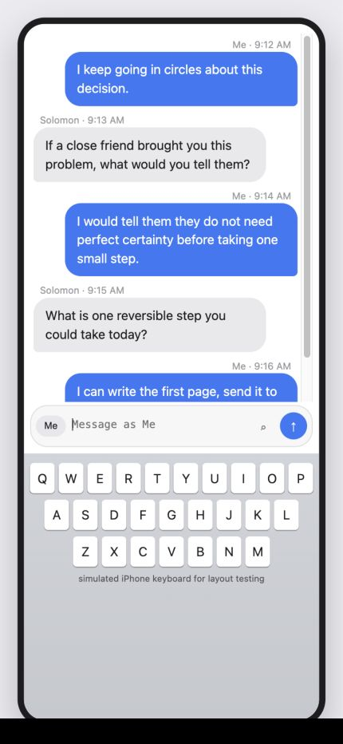

# Solomon Chat

> This is the app that alex hormozi always wanted.

Solomon Chat turns an ordinary Obsidian note into a private text conversation with the wiser version of you. It is a friendlier, purpose-built version of the self-distancing practice Alex Hormozi has described doing in a simple Google Doc.

<p align="center">
  
</p>

<p align="center"><em>Inspired by the Solomon Project practice Alex Hormozi has shared publicly.</em></p>

In the age of AI, we are no longer in short supply of skill. We are in short supply of good thinking. Solomon Chat was built to make clear thinking easier to practice.

## Why this exists

My pastor always suggested writing a letter from yourself to God, then writing a letter from God back to you. The point was not to pretend to speak for God. It was to step outside the emotion of the moment, make room for honesty, and listen for the wisdom that can be hard to hear from inside your own problem.

I wanted an easy way to do that kind of self-distanced journaling without turning it into a formal writing exercise. A text conversation felt natural. One side can be you today. The other can be your older self, a wise friend, a mentor, or any character whose perspective helps you think clearly.

Then I heard Alex Hormozi describe his own version. He calls the wiser character Solomon, imagines him as his 85-year-old self, and keeps an ongoing written conversation with him. In one podcast conversation, Hormozi explains that he reserves the first hour of Monday for the exercise, writes back and forth as if it were a chat, and uses a Google Doc because the older version of himself has the same context and aligned incentives. [Read the episode transcript](https://podscripts.co/podcasts/the-game-with-alex-hormozi/uncovering-insights-and-wisdom-with-your-future-self-with-danny-miranda-pt2-july-23-ep-594).

Hormozi did not invent self-distancing. What he helped popularize was a memorable, repeatable implementation: ask the wiser version of yourself, then write the answer from that perspective. Solomon Chat turns that implementation into an interface that feels like texting.

## The Solomon paradox

The name comes from the Solomon paradox, the tendency to reason more wisely about another person's problems than about our own. The term was introduced in research by Igor Grossmann and Ethan Kross. Across three experiments involving close relationship conflicts, participants showed wiser reasoning about other people's situations than their own. Adopting a self-distanced perspective reduced that gap. The researchers evaluated qualities such as recognizing uncertainty, considering other perspectives, looking for compromise, and anticipating change. [Read the original 2014 study](https://doi.org/10.1177/0956797614535400).

Solomon Chat does not try to give you answers. It gives you a simple structure for asking better questions and hearing your own answers from a little farther away.

## See it in action

<table>
  <tr>
    <td width="64%"></td>
    <td width="36%"></td>
  </tr>
  <tr>
    <td align="center"><strong>Desktop preview</strong></td>
    <td align="center"><strong>Phone keyboard layout test</strong></td>
  </tr>
</table>

## How to use it

1. Create a new Solomon conversation from the Obsidian command palette.
2. Name the two sides. A simple starting point is `Solomon` and `Me`.
3. Write the situation honestly from your current point of view.
4. Switch sides and answer as the person who can see the problem more clearly.
5. Keep going until the next honest action becomes easier to see.

You can give either character a name, bio, and vault image. You can also attach pictures and files to the conversation just as you would in a normal message thread.

### Customize a chat background

Open the conversation's **⋯** menu and choose **Chat background…**, or run **Solomon Chat: Change chat background** while in chat view. Select **Choose picture** to search pictures in your vault, or enter a vault-relative path such as `Wallpapers/quiet-sky.jpg`, then Save. Add photos to your vault first. You can also pick a color. Use the color reset button and clear the wallpaper field to return to the Obsidian theme.

On mobile, the keyboard's Enter key inserts a new line; the chat's Send button sends the message. The composer stays mounted during sends. New messages follow automatically while you are at the bottom; reading older messages preserves your position and offers **Latest**.

PNG, JPEG, WebP, GIF, and AVIF wallpapers are supported. Add the image to your vault first; images are not downloaded from remote URLs. Sync the image along with the conversation to use it on another device. Missing or renamed images fall back to the selected color or theme. Background preferences are stored in the conversation's `chat-background-color` and `chat-background-image` frontmatter; other chats are unaffected.

The composer stays mounted through sending. Text edits, attachments, and duplicate sends are briefly guarded while the current message is saved; the plugin does not deliberately dismiss and reopen the keyboard or steal focus on completion.

## Your notes are yours, forever

Obsidian is built around a durable idea: your notes should remain yours even if the software around them disappears. Solomon Chat follows the same rule.

Every conversation is a normal Markdown file. There is no hidden message database, required account, cloud service, or proprietary chat format. If Solomon Chat stops working, if you uninstall it, or if you export the raw files, the conversation is still readable. You can open it in any text editor, move it to another notes app, or print it and read it without a computer.

```md
---
solomon-chat: true
conversation-id: "conversation-8f21c4d1"
left-name: Solomon
right-name: Me
next-side: right
attachment-folder: "Solomon Conversations/Example.attachments"
---

<!-- solomon-chat:right|2026-07-19 09:12|msg-a1b2c3 -->
### Me · 2026-07-19 09:12

I keep going in circles about this decision.

<!-- solomon-chat:left|2026-07-19 09:13|msg-d4e5f6 -->
### Solomon · 2026-07-19 09:13

If a close friend brought you this problem, what would you tell them?
```

The small HTML comments preserve message identity and speaker position while remaining hidden in normal Markdown reading views. The speaker headings and message bodies are standard Markdown, and images and files use ordinary relative Markdown links. Participant names, bios, and avatar paths use readable frontmatter. Raw Markdown mode and plain text transcript export are always available. Existing bracket-marker conversations remain supported.

## Features

- Familiar left and right message bubbles with automatic speaker switching
- Editable participant names, bios, colors, and optional vault-image avatars
- Picture and file attachments stored in message-specific subfolders beside the conversation, with ordinary relative Markdown links
- Enter to send and Shift+Enter for a new line
- Discoverable message actions by tap, keyboard focus, right-click, or long-press; deletion requires confirmation
- Optional perspective prompts inspired by self-distancing research
- Raw Markdown mode and readable text transcript export
- Separate desktop, iPhone, and Android keyboard layout behavior
- Serialized file writes so rapid sends cannot overwrite one another
- A fast 200-message initial history window with stable-position loading for earlier messages
- No account, analytics, AI API, or network transmission

## Install

### Obsidian Community Plugins

Once the community listing is approved:

1. Open **Settings > Community plugins** in Obsidian.
2. Select **Browse** and search for **Solomon Chat**.
3. Select **Install**, then **Enable**.

### Manual installation

1. Download `main.js`, `manifest.json`, and `styles.css` from the [latest release](https://github.com/WestB-DEV/Solomon-Chat/releases/latest).
2. Place the three files in `<your-vault>/.obsidian/plugins/solomon-chat/`.
3. Open **Settings > Community plugins** and enable **Solomon Chat**.

## Development

1. Run `npm install` and `npm run build`.
2. Copy or symlink this directory into a test vault at `.obsidian/plugins/solomon-chat`.
3. Enable **Solomon Chat** under Obsidian > Settings > Community plugins.

Use a dedicated test vault while developing plugins.

See [TESTING.md](TESTING.md) for the mobile harness, recorded layout geometry, and the physical-device launch checklist.

## Sources and further reading

- [Grossmann and Kross, "Exploring Solomon's Paradox," Psychological Science, 2014](https://doi.org/10.1177/0956797614535400)
- [Alex Hormozi on writing conversations with his 85-year-old self in a Google Doc](https://podscripts.co/podcasts/the-game-with-alex-hormozi/uncovering-insights-and-wisdom-with-your-future-self-with-danny-miranda-pt2-july-23-ep-594)
- [Alex Hormozi describing his weekly Solomon document and Monday practice](https://podscripts.co/podcasts/the-game-with-alex-hormozi/the-road-to-becoming-a-billionaire-pt1-on-iced-coffee-hour-ep-660)

## Independence and attribution

Solomon Chat is an independent project. It is not affiliated with or endorsed by Alex Hormozi, Acquisition.com, the study authors, or Obsidian. Alex Hormozi's public description of his Solomon Project practice inspired the interface. The attached portrait was supplied by the project creator for this repository.

This project is not medical, mental health, religious, or therapeutic advice.

## License

MIT
